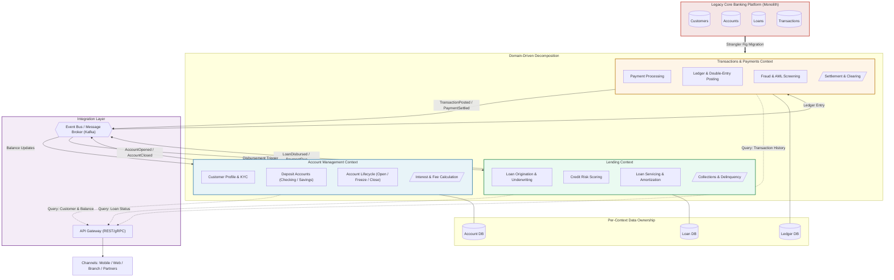

```mermaid
flowchart TB
    subgraph Legacy["Legacy Core Banking Platform (Monolith)"]
        direction TB
        L1[("Customers")]
        L2[("Accounts")]
        L3[("Loans")]
        L4[("Transactions")]
    end

    Legacy ==>|"Strangler Fig Migration"| Refactor

    subgraph Refactor["Domain-Driven Decomposition"]
        direction TB

        subgraph AM["Account Management Context"]
            direction TB
            AM1["Customer Profile & KYC"]
            AM2["Deposit Accounts (Checking / Savings)"]
            AM3["Account Lifecycle (Open / Freeze / Close)"]
            AM4[/"Interest & Fee Calculation"/]
        end

        subgraph LN["Lending Context"]
            direction TB
            LN1["Loan Origination & Underwriting"]
            LN2["Credit Risk Scoring"]
            LN3["Loan Servicing & Amortization"]
            LN4[/"Collections & Delinquency"/]
        end

        subgraph TP["Transactions & Payments Context"]
            direction TB
            TP1["Payment Processing"]
            TP2["Ledger & Double-Entry Posting"]
            TP3["Fraud & AML Screening"]
            TP4[/"Settlement & Clearing"/]
        end
    end

    subgraph Integration["Integration Layer"]
        direction LR
        EventBus{{"Event Bus / Message Broker (Kafka)"}}
        API["API Gateway (REST/gRPC)"]
    end

    AM -->|"AccountOpened / AccountClosed"| EventBus
    LN -->|"LoanDisbursed / PaymentDue"| EventBus
    TP -->|"TransactionPosted / PaymentSettled"| EventBus

    EventBus -->|"Balance Updates"| AM
    EventBus -->|"Disbursement Trigger"| LN
    EventBus -->|"Ledger Entry"| TP

    AM -.->|"Query: Customer & Balance"| API
    LN -.->|"Query: Loan Status"| API
    TP -.->|"Query: Transaction History"| API

    API --> Consumers["Channels: Mobile / Web / Branch / Partners"]

    subgraph DataStores["Per-Context Data Ownership"]
        direction LR
        DB1[("Account DB")]
        DB2[("Loan DB")]
        DB3[("Ledger DB")]
    end

    AM --- DB1
    LN --- DB2
    TP --- DB3

    style Legacy fill:#f5e6e6,stroke:#c0392b,stroke-width:2px
    style AM fill:#e8f4f8,stroke:#2874a6,stroke-width:2px
    style LN fill:#eafaf1,stroke:#1e8449,stroke-width:2px
    style TP fill:#fef5e7,stroke:#b9770e,stroke-width:2px
    style Integration fill:#f4ecf7,stroke:#7d3c98,stroke-width:2px
```
