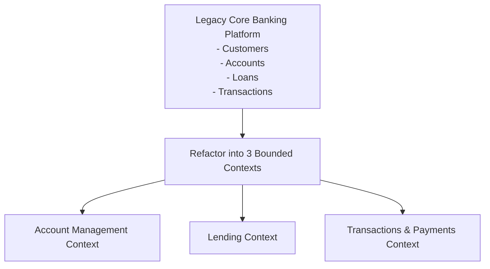

```mermaid
flowchart TD
    A[Legacy Core Banking Platform<br/>- Customers<br/>- Accounts<br/>- Loans<br/>- Transactions] --> B[Refactor into 3 Bounded Contexts]
    B --> C[Account Management Context]
    B --> D[Lending Context]
    B --> E[Transactions & Payments Context]
```
